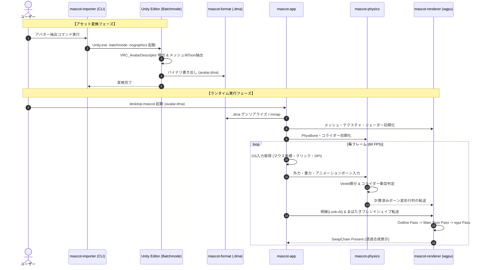

# 基本アーキテクチャ設計 (Architecture Design)

## 1. 全体アーキテクチャ概要

本システムは、高い実行速度・メモリ安全性・省電力を両立させるため、**Rust Workspace** によるマルチクレート構成を採用する。
役割ごとにクレートを疎結合に分割し、単体テスト容易性、並行開発性、およびコードの保守性を高める。

```
desktop-mascot/
├── Cargo.toml                  # Workspace Root
├── crates/
│   ├── mascot-app/             # アプリケーション層 (winitイベントループ, ウィンドウ制御, egui UI, AI対話)
│   ├── mascot-renderer/        # 描画層 (wgpuパイプライン, WGSLシェーダー, テクスチャ, メッシュバッファ)
│   ├── mascot-physics/         # 物理演算層 (PhysBone Verlet積分, コライダー衝突解決, スプリング)
│   ├── mascot-format/          # データ定義・バイナリ層 (.dma パーサー/シリアライザ, メモリ配置)
│   └── mascot-importer/        # アセット変換ツール層 (Unity batchmode連携, CLIインポータ)
├── unity-package/              # Unityエクスポート用 C# エディタ拡張
│   └── Editor/
│       └── DmaExporter.cs
└── docs/                       # 設計ドキュメント
```

---

## 2. クレート構成と責務

| クレート名 | 役割・責務 | 主な依存関係 |
| :--- | :--- | :--- |
| **`mascot-app`** | アプリケーションのエントリポイント、`winit` によるイベントループ制御、Windows OSネイティブAPI連携（ウィンドウ透過・クリックスルー）、`egui` による吹き出し／設定UI描画、ユーザー入力処理、AI対話マネージャ | `mascot-renderer`, `mascot-physics`, `mascot-format`, `winit`, `windows`, `egui`, `egui-winit`, `egui-wgpu` |
| **`mascot-renderer`** | `wgpu` を用いたグラフィックスパイプライン管理、DirectX 12/Vulkanサーフェス生成、lilToon再現WGSLシェーダー、Inverted Hullアウトライン描画、ブレンドシェイプ・スキニングGPU適用、テクスチャロード | `mascot-format`, `wgpu`, `bytemuck`, `glam` |
| **`mascot-physics`** | VRC PhysBoneに準拠した物理演算（位置Verlet積分）、球／カプセルコライダーの衝突判定、角度・距離制約、VRM SpringBoneフォールバック、ボーン変形行列の計算 | `mascot-format`, `glam` |
| **`mascot-format`** | 独自最適化フォーマット `.dma` (Desktop Mascot Avatar) のデータ構造定義、バイナリシリアライズ／デシリアライズ、高速な読み込み（ゼロコピー／mmap） | `serde`, `bincode` (または rkyv), `glam`, `bytemuck` |
| **`mascot-importer`** | Unity Editorのバッチモード (`Unity.exe -batchmode -nographics`) をサブプロセスとして実行し、Unityプロジェクト内のアバターを自動抽出して `.dma` を出力するCLIツール | `mascot-format`, `clap`, `tokio` |

---

## 3. ウィンドウ制御アーキテクチャ (Windowing & OS Integration)

デスクトップマスコットの最大の特徴である「背景完全透過」「最前面固定」「透明領域のクリックスルー」を実現するため、`winit` と Windows Win32 API (`windows-rs` / `windows-sys`) を統合する。

### 3.1 透過ウィンドウの初期化手順
1. **winit ウィンドウ生成**:
   - `WindowAttributes::default()` にて `with_decorations(false)` (枠なし), `with_transparent(true)` (透過有効), `with_window_level(WindowLevel::AlwaysOnTop)` を設定。
2. **Win32 レイヤードウィンドウ設定**:
   - `winit::raw_window_handle` からウィンドウハンドル (`HWND`) を取得。
   - `SetWindowLongPtrW` を呼び出し、拡張ウィンドウスタイルに `WS_EX_LAYERED` および `WS_EX_TOPMOST` を付与。
3. **DWM (Desktop Window Manager) ガラス効果・透過拡張**:
   - `DwmExtendFrameIntoClientArea` API を呼び出し、マージンに `MARGINS { cxLeftWidth: -1, cxRightWidth: -1, cyTopHeight: -1, cyBottomHeight: -1 }` を指定。クライアント領域全体をDWMコンポジタの透過対象として登録。

### 3.2 クリックスルー (透過ヒットテスト) アーキテクチャ
透明な部分をクリックした際に背面のアプリへイベントを通過させ、キャラクター本体をクリックしたときのみ入力を受け取る仕組みを2段階で提供する。

```mermaid
flowchart TD
    MouseMsg[OS マウスメッセージ (WM_NCHITTEST / WM_SETCURSOR)] --> CheckPixel{カーソル位置の判定}
    CheckPixel -->|透過ピクセル (Alpha < 閾値)| PassThrough[HTTRANSPARENT を返却<br/>背面ウィンドウへ透過]
    CheckPixel -->|不透明ピクセル (Alpha >= 閾値)| HitMascot[HTCLIENT を返却<br/>マスコットの操作イベントとして捕捉]
    HitMascot --> DragCheck{ドラッグ操作か?}
    DragCheck -->|Yes| MoveWindow[ReleaseCapture & WM_NCLBUTTONDOWN<br/>ウィンドウ自体を移動]
    DragCheck -->|No| Interaction[クリック / なでなで / 表情変化]
```

- **高速ヒットテスト方式**:
  - メッシュのCPU側AABB（バウンディングボックス）および 簡易バウンディング球による高速事前カリング。
  - 必要に応じて、直近フレームでレンダリングされたアルファバッファ（またはオフスクリーンに保持した低解像度ヒットマップ）からカーソル下のピクセルアルファ値をサンプリング（$\alpha > 0.05$ の場合のみヒット）。
- **ドラッグ移動**:
  - キャラクターの体をクリック＆ドラッグした際、`PostMessage(hwnd, WM_NCLBUTTONDOWN, HTCAPTION, lParam)` を送出することで、OS標準の滑らかなウィンドウ移動を実現。

---

## 4. レンダリングパイプライン (wgpu Graphics Pipeline)

`mascot-renderer` は、透過ウィンドウ上で正しいアニメ調描画を行うため、**Pre-multiplied Alpha (乗算済みアルファ)** とマルチパス描画を採用する。

### 4.1 パイプライン構成
1. **Uniform Buffer / Camera Buffer**:
   - View-Projection 行列、ライト方向（デスクトップ環境光）、環境光強度、カメラ位置。
2. **Skeletal Animation & BlendShape Pass (Compute / Vertex Shader)**:
   - メッシュの頂点データに対して、GPUスキニング（ボーン行列パレットによる4ボーンウェイトブレンド）および ブレンドシェイプ変位（モーフターゲット）を適用。
3. **Pass 1: Inverted Hull Outline Pass**:
   - カリングモード: `Front` (表面をカリングし、裏面のみを描画)。
   - 頂点シェーダーで法線方向へ頂点を微小押し出し。
   - 単色アウトラインカラーを出力。
4. **Pass 2: Main Toon Shading Pass**:
   - カリングモード: `Back` (通常の表面描画)。
   - 2段階トゥーン明暗判定（Dot(Normal, Light)の閾値ランプ）。
   - lilToon準拠の MatCap、Normal Map、RimLight、Emission の合成。
5. **Pass 3: UI Overlay (egui)**:
   - 吹き出し、リアクションアイコン、設定メニューをオーバーレイ描画。

---

## 5. データフロー全体図

アバターの変換からランタイム実行までのデータフローは以下の通りである。



---

## 6. スレッドモデル & 並行性設計

常駐アプリとしての低負荷・無遅延を実現するため、スレッド分離を明確に行う。

1. **メインスレッド (Main Event Loop)**:
   - `winit` の `EventLoop` を専有。OSメッセージ処理、入力ハンドリング、ウィンドウリサイズ、`egui` 入力を担当。
2. **描画・物理シミュレーション (Render & Sim)**:
   - 描画同期（V-Sync 60Hz）に合わせて物理演算とレンダリングを実行。
3. **バックグラウンド非同期ワーカー (Async Runtime / Tokio)**:
   - AI対話（LLM APIリクエスト、音声合成、長文生成など）を完全非同期で処理。
   - メインスレッドを1ミリ秒たりともブロックせず、レスポンスが到着した時点でチャネル（`tokio::sync::mpsc`）を通じてメインスレッドへ結果を通知。
