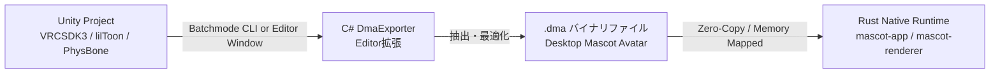

# アバター変換パイプライン設計書 (Avatar Pipeline Specification)

## 1. パイプライン概要

本システムは、VRChat向けアバター（Unity 2022.3 LTS、VRCSDK3-AVATAR、lilToonシェーダー、VRC PhysBone設定済み）を、デスクトップマスコットランタイムで極めて高速かつ高忠実度に描画・駆動できる独自バイナリ形式 **`.dma` (Desktop Mascot Avatar)** へ変換・エクスポートするパイプラインを提供する。



### 設計指針
1. **完全自動化 & ヘッドレス実行**: Unity Editor GUIを介さず、CLI（コマンドライン）からバッチモードで即時エクスポート可能とする。
2. **シェーダーパラメータの忠実な抽出**: lilToonのマテリアル設定（BaseColor、陰影境界・ぼかし、Inverted Hullアウトライン幅・色、RimLight等）を漏れなくパースし、WGSLシェーダー用パラメータへ射影。
3. **ゼロコピー＆高速起動**: `.dma` ファイルは実行時オーバーヘッドを極小化するため、メモリ配置が最適化されたバイナリフォーマットとし、アバター読み込み時間をミリ秒オーダーに抑える。

---

## 2. Unity エクスポートスクリプト (`DmaExporter.cs`)

### 2.1 動作モード
- **エディタ拡張GUI**: Unityエディタ上部メニュー `Tools > Desktop Mascot > Export Active Avatar` からプレビューとワンクリックエクスポートを実行。
- **バッチモードCLI**: コマンドライン引数から呼び出し、Unityをヘッドレス起動してエクスポート完了後に終了。

```powershell
# バッチモード実行例
& "C:\Program Files\Unity\Hub\Editor\2022.3.22f1\Editor\Unity.exe" `
  -batchmode -nographics -quit `
  -projectPath "E:\MyAvatarProject" `
  -executeMethod "DesktopMascot.Editor.DmaExporter.ExportCommandLine" `
  -avatarName "MyAvatarPrefab" `
  -outputPath "E:\develop\desktop-mascot\assets\avatar.dma"
```

### 2.2 抽出対象コンポーネントとデータ対応関係

| Unity / VRChat コンポーネント | 抽出する主要データ | `.dma` 内の格納セクション |
| :--- | :--- | :--- |
| `VRCAvatarDescriptor` | ViewPosition (目線基準点)、リップシンクBlendShape指定、まばたきBlendShape指定 | `METADATA` |
| `Transform` 階層 | Armatureスケルトンツリー、Local Transform、バインドポーズ逆行列 (`InverseBindPose`) | `SKELETON` |
| `SkinnedMeshRenderer` / `Mesh` | 頂点座標、法線、接線 (Tangent)、UV0/UV1、BoneWeights (4ボーン/頂点)、インデックスバッファ | `MESH` |
| BlendShapes (Morph Targets) | デルタ頂点位置、デルタ法線、デルタ接線、ウェイト名リスト | `MORPH_TARGETS` |
| `Material` (`lilToon`) | メインカラー、影色、影範囲/境界ぼかし、アウトライン設定、テクスチャデータ (PNG/DDS/KTX2) | `MATERIALS` |
| `VRCPhysBone` | ボーンチェーンルート、Spring/Pull/Damping、重力/硬さ、最大角度制限、衝突コライダー参照 | `PHYSBONE` |
| `VRCPhysBoneCollider` | コライダー形状 (Sphere, Capsule, Plane)、半径、高さ、Inside/Outside判定 | `COLLIDERS` |
| `AnimationClip` | Idleループ、呼吸、歩行などのボーンおよびBlendShapeキーフレームデータ | `ANIMATIONS` |

---

## 3. `.dma` バイナリフォーマット仕様

`.dma` は、4バイトのアラインメントを保ったバイナリコンテナ形式である。ファイル先頭に固定長ヘッダーとチャンク目録（Table of Contents）を配置し、各チャンクは独立したペイロードとして読み込みまたはダイレクトメモリマップが可能である。

### 3.1 ファイル構造レイアウト

```
+-------------------------------------------------------------+
| Header (32 bytes)                                           |
|   Magic: 'D', 'M', 'A', '1' (0x31414D44)                     |
|   Version: 1 (uint32)                                       |
|   Flags: 0 (uint32: bit0=Compressed, bit1=EndianLittle)     |
|   TotalFileSize: uint64                                     |
|   ChunkCount: uint32                                        |
|   Reserved: 8 bytes                                         |
+-------------------------------------------------------------+
| Table of Contents (ChunkCount * 24 bytes)                   |
|   [Chunk 0] Type: uint32, Offset: uint64, Length: uint64    |
|   [Chunk 1] Type: uint32, Offset: uint64, Length: uint64    |
|   ...                                                       |
+-------------------------------------------------------------+
| Chunk Payloads (Aligned to 16 bytes)                        |
|   CHUNK_META        (0x4154454D: 'META')                    |
|   CHUNK_SKEL        (0x4C454B53: 'SKEL')                    |
|   CHUNK_MESH        (0x4853454D: 'MESH')                    |
|   CHUNK_MORPH       (0x50524F4D: 'MORP')                    |
|   CHUNK_MAT         (0x2054414D: 'MAT ')                    |
|   CHUNK_PHYS        (0x53594850: 'PHYS')                    |
|   CHUNK_ANIM        (0x4D494E41: 'ANIM')                    |
+-------------------------------------------------------------+
```

### 3.2 チャンク詳細定義

#### 1. CHUNK_META (アバターメタ情報)
JSONまたはMessagePack形式で格納（デバッグ容易性と拡張性を確保）。
```json
{
  "avatar_name": "Kikyo",
  "author": "Nagano",
  "view_position": [0.0, 1.35, 0.08],
  "scale": 1.0,
  "viseme_blendshapes": {
    "sil": 0, "aa": 1, "ih": 2, "ou": 3, "ee": 4, "oh": 5
  },
  "blink_blendshapes": {
    "blink": 12, "blink_l": 13, "blink_r": 14
  }
}
```

#### 2. CHUNK_SKEL (スケルトン階層)
```rust
#[repr(C)]
pub struct RawBone {
    pub name: [u8; 64],           // UTF-8 NULL終端文字列
    pub parent_index: i32,        // ルートは -1
    pub local_position: [f32; 3], // 親基準のローカル座標
    pub local_rotation: [f32; 4], // クォータニオン (x, y, z, w)
    pub local_scale: [f32; 3],
    pub inverse_bind_matrix: [f32; 16], // 4x4 行列
}
```

#### 3. CHUNK_MESH (メッシュデータ)
頂点属性はインターリーブされ、wgpuの頂点バッファへダイレクトに転送可能。
```rust
#[repr(C)]
pub struct DmaVertex {
    pub position: [f32; 3],
    pub normal: [f32; 3],
    pub tangent: [f32; 4],        // wは従法線の符号 (+1.0 or -1.0)
    pub uv0: [f32; 2],
    pub uv1: [f32; 2],
    pub bone_indices: [u16; 4],
    pub bone_weights: [f32; 4],
}
```

#### 4. CHUNK_MORPH (ブレンドシェイプ)
スパース表現（変化のある頂点インデックスのみを格納）によりファイル容量を削減。
```rust
#[repr(C)]
pub struct MorphTargetHeader {
    pub name: [u8; 32],
    pub delta_count: u32,
    // 続いて DeltaVertex[delta_count] が配置
}

#[repr(C)]
pub struct DeltaVertex {
    pub vertex_index: u32,
    pub delta_position: [f32; 3],
    pub delta_normal: [f32; 3],
    pub delta_tangent: [f32; 3],
}
```

#### 5. CHUNK_MAT (lilToon マテリアルパラメータ)
lilToonのレンダリングに必要な主要パラメータブロック。
```rust
#[repr(C)]
pub struct LilToonMaterialParams {
    pub base_color: [f32; 4],            // RGBA
    pub shade_color: [f32; 4],           // 1影色
    pub shade2_color: [f32; 4],          // 2影色
    pub shade_border: f32,               // 陰影境界 (0.0 - 1.0)
    pub shade_blur: f32,                 // 陰影ぼかし
    pub shade2_border: f32,
    pub shade2_blur: f32,
    
    // アウトライン
    pub outline_color: [f32; 4],
    pub outline_width: f32,              // 頂点法線方向の押し出し幅
    pub outline_enable: u32,             // 0: 無効, 1: 有効
    pub outline_vertex_color_blend: f32, // 頂点カラーによる太さ制御
    
    // リムライト & 発光
    pub rim_color: [f32; 4],
    pub rim_border: f32,
    pub rim_blur: f32,
    pub emission_color: [f32; 4],
    
    // テクスチャインデックス (-1: なし)
    pub base_texture_idx: i32,
    pub shade_texture_idx: i32,
    pub outline_texture_idx: i32,
    pub normal_texture_idx: i32,
}
```

#### 6. CHUNK_PHYS (PhysBoneパラメータ)
```rust
#[repr(C)]
pub struct PhysBoneChain {
    pub root_bone_index: u32,
    pub pull: f32,                       // 復元力 (0.0 - 1.0)
    pub spring: f32,                     // スプリング性
    pub damping: f32,                    // 減衰衰退率
    pub stiffness: f32,                  // 硬さ
    pub gravity: [f32; 3],               // 重力ベクトル
    pub max_angle: f32,                  // 最大屈曲角 (ラジアン)
    pub radius: f32,                     // コライダー判定半径
    pub collider_indices: [u32; 8],      // 衝突対象コライダー番号 (最大8個)
    pub collider_count: u32,
}
```

---

## 4. CLI インポータツール (`mascot-importer`)

### 4.1 コマンドライン仕様
Rust製CLIバイナリとして実装され、Unity実行環境の自動探索とエクスポートを一括管理する。

```bash
# 構文
mascot-importer [OPTIONS] --unity-project <PATH> --output <FILE>

# オプション一覧:
#   -p, --unity-project <PATH>  Unityプロジェクトのルートパス
#   -u, --unity-exe <PATH>      Unity.exeのパス (省略時はレジストリ/Hubから自動検出)
#   -a, --avatar-name <NAME>    特定のアバターを指定 (省略時はシーン内の先頭アバター)
#   -o, --output <FILE>         出力先 .dma ファイルパス
#   --compress                  データチャンクを Zstandard で圧縮
#   --validate                  エクスポート後の .dma をロードして整合性検証
```

### 4.2 実行フロー
1. **環境検出**: 指定パス内の `ProjectVersion.txt` を読み込み、必要なUnityバージョンを特定。
2. **Unity実行**: サブプロセスとして Unity batchmode を呼び出し、C#エクスポートロジックを実行。
3. **バリデーション**: 生成された `.dma` を `mascot-format` クレートでデシリアライズし、頂点数・ボーン参照・テクスチャ破損をチェック。
4. **サマリー出力**: 頂点数、マテリアル数、PhysBone数、ファイルサイズをコンソールに表示。
