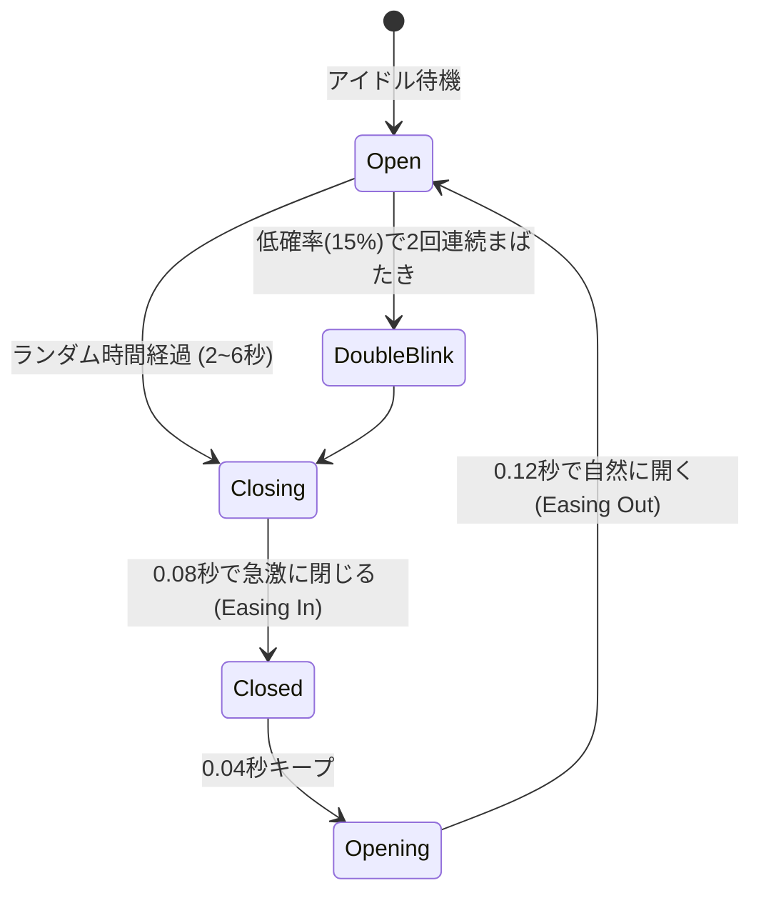
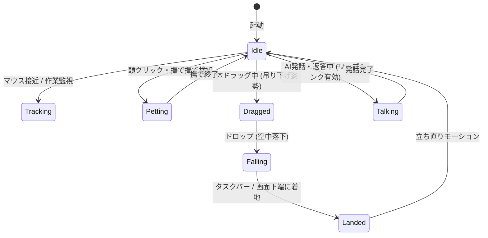

# 物理演算＆アニメーション設計書 (Physics & Animation Specification)

## 1. 物理演算アーキテクチャ (`mascot-physics`)

VRChatアバターの代名詞である揺れもの（髪の毛、リボン、スカート、胸、アクセサリー等）の自然な挙動を再現するため、**VRC PhysBoneの計算モデルに準拠した位置ベースのVerlet積分（Position-Based Verlet Integration）物理エンジン** をRustでゼロから実装する。

```mermaid
flowchart TD
    FrameStart[フレーム開始 (Δt)] --> AnimUpdate[基本スケルトンポーズの算出 (Idle / IK)]
    AnimUpdate --> Inertia[慣性・外力の適用 (ウィンドウ移動加速度・重力)]
    Inertia --> VerletStep[Verlet位置積分ステップ]
    VerletStep --> SolveLen[ボーン長・距離制約の解決 (Distance Constraint)]
    SolveLen --> SolveAngle[最大角度・曲がり制限の解決 (Angle Limit)]
    SolveAngle --> SolveColl[コライダー衝突解決 (Sphere / Capsule)]
    SolveColl --> FinalPose[物理ボーン行列の確定]
    FinalPose --> RenderSync[レンダラーへ行列転送]
```

---

## 2. PhysBone アルゴリズム実装

### 2.1 Verlet 数値積分
各物理質点（ボーン接合部）の状態は、現在位置 $\vec{x}_t$、前回位置 $\vec{x}_{t-1}$、および加速度 $\vec{a}$ によって更新される。速度を明示的に保持しないため、数値的安定性が極めて高い。

$$\vec{x}_{t+\Delta t} = \vec{x}_t + (1 - d) \cdot (\vec{x}_t - \vec{x}_{t-\Delta t}) + \vec{a} \cdot \Delta t^2$$

- $d \in [0, 1]$: 減衰率（`damping`）
- $\vec{a}$: 重力（`gravity`）＋ ウィンドウ自体の移動に伴う慣性加速度（$- \vec{a}_{\text{window}}$）

### 2.2 スプリング・復元力（Pull Force）
ボーンの初期バインドポーズ（アニメーション後の目標位置 $\vec{p}_{\text{target}}$）へ引き戻す復元力を適用する。

$$\vec{x}' = \text{lerp}(\vec{x}_{t+\Delta t}, \vec{p}_{\text{target}}, \text{pull} \cdot \Delta t \cdot 60.0)$$

### 2.3 幾何拘束（Constraints）の反復解決

#### 1. 距離拘束 (Distance Constraint)
剛体としてのボーンの長さ $L$ を維持するため、親質点 $\vec{x}_{\text{parent}}$ からの距離を強制補正する。

$$\vec{x}_{\text{constrained}} = \vec{x}_{\text{parent}} + L \cdot \frac{\vec{x} - \vec{x}_{\text{parent}}}{\|\vec{x} - \vec{x}_{\text{parent}}\|}$$

#### 2. 最大角度拘束 (Angle Limit Cone)
親ボーンのローカル座標系における初期方向ベクトル $\vec{v}_{\text{rest}}$ に対し、現在の屈曲角が許容角度 $\theta_{\text{max}}$ を超えた場合、円錐（Cone）の表面上にクランプする。

```rust
pub fn clamp_angle(current_dir: Vec3, rest_dir: Vec3, max_angle_rad: f32) -> Vec3 {
    let dot = current_dir.dot(rest_dir).clamp(-1.0, 1.0);
    let angle = dot.acos();
    if angle <= max_angle_rad {
        current_dir
    } else {
        // 回転軸周りに max_angle_rad だけ回転したベクトルを算出
        let axis = rest_dir.cross(current_dir).normalize_or_zero();
        if axis.length_squared() < 1e-6 {
            rest_dir
        } else {
            Quat::from_axis_angle(axis, max_angle_rad) * rest_dir
        }
    }
}
```

---

## 3. コライダー衝突解決 (Collision Detection)

PhysBoneが頭や胴体、手足などの人体メッシュにめり込むのを防ぐため、3種類のコライダー形状をサポートする。

| コライダー種類 | 衝突判定アルゴリズム | 補正方法 |
| :--- | :--- | :--- |
| **球 (Sphere)** | 点 $\vec{x}$ と中心点 $\vec{c}$ の距離 $d = \|\vec{x} - \vec{c}\|$ を計算 | $d < (r + r_{\text{bone}})$ の場合、中心から外側へ押し出し |
| **カプセル (Capsule)** | 線分 $AB$ 上で $\vec{x}$ に最も近い最近接点 $\vec{p}$ を算出、$\|\vec{x} - \vec{p}\|$ で判定 | 最近接点から半径外へ放射状に押し出し |
| **平面 (Plane)** | 平面法線 $\vec{n}$ との符号付き距離 $d = (\vec{x} - \vec{p}_0) \cdot \vec{n}$ を計算 | $d < r_{\text{bone}}$ の場合、法線方向へ押し出し |

### カプセル最近接点の計算実装
```rust
pub fn closest_point_on_segment(a: Vec3, b: Vec3, point: Vec3) -> Vec3 {
    let ab = b - a;
    let ab_len_sq = ab.length_squared();
    if ab_len_sq < 1e-6 {
        return a;
    }
    let t = ((point - a).dot(ab) / ab_len_sq).clamp(0.0, 1.0);
    a + ab * t
}
```

---

## 4. プロシージャル・アニメーションシステム

外部のモーションデータ（FBX/BVH）に依存せずとも、キャラクターが生き生きと自然にデスクトップ上に佇むためのプロシージャル駆動機構を実装する。

### 4.1 呼吸アニメーション (Breathing Generator)
胸ボーン（Chest / Spine）と肩ボーンに対し、滑らかなサイン波による微小な拡縮・ピッチ回転を加算。

$$\Delta \theta_{\text{chest}} = A_{\text{breath}} \cdot \sin(2\pi \cdot f_{\text{breath}} \cdot t)$$

- 周波数: 約 0.25 Hz（4秒周期）
- 振幅: ピッチ角 1.5° 程度

### 4.2 自然なまばたき生成器 (Stochastic Eye Blink)
完全に規則的な周期ではなく、ポアソン過程に基づき2〜6秒のランダムなインターバルでまばたきをトリガー。



BlendShapeのウェイトカーブ:
$$w(t) = \begin{cases} 
\frac{t}{t_{\text{close}}} & (0 \le t < t_{\text{close}}) \\
1.0 & (t_{\text{close}} \le t < t_{\text{close}} + t_{\text{hold}}) \\
1.0 - \frac{t - t_{\text{close}} - t_{\text{hold}}}{t_{\text{open}}} & (\text{開動作})
\end{cases}$$

### 4.3 マウス視線追従 (Look-At IK)
デスクトップ上で作業するユーザーのマウスカーソル座標を常時追跡し、頭部と瞳がカーソルを自然に見つめる。

1. **スクリーン座標からワールド目標点への変換**:
   マウスのスクリーン座標 $(x_{\text{mouse}}, y_{\text{mouse}})$ を、3D空間におけるマスコット正面平面上の点 $\vec{T}$ に逆投影。
2. **2段階IK回転配分**:
   - 頭部ボーン（Head）: 目標方向への回転の 65% を負担（Yaw $\pm 45^\circ$, Pitch $\pm 25^\circ$ でクランプ）
   - 首ボーン（Neck）: 目標方向への回転の 35% を負担
   - 瞳ボーンまたは視線BlendShape: 微小な視線補正
3. **滑らかな減衰補間 (SmoothDamp)**:
   マウスが素早く動いた場合も、首が急激に向きを変えないよう、臨界減衰（Critically Damped Spring）フィルタを通して回転角を更新。

---

## 5. モーションステートマシン

マスコットの状態遷移モデル：


