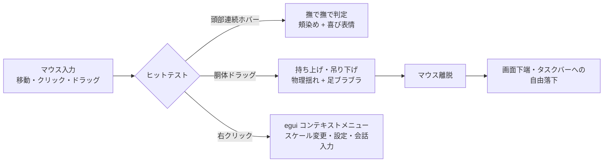

# インタラクション＆AI対話設計書 (Interaction & AI Specification)

## 1. ユーザーインタラクション設計

デスクトップマスコットの真髄は、デスクトップ上で作業を邪魔せず、触れ合える「実在感」にある。直感的なマウス操作とWindowsデスクトップ環境への適応ロジックを実装する。



---

## 2. インタラクション機能詳細

### 2.1 頭部なでなで判定 (Head Petting Mechanics)
- **検出アルゴリズム**:
  - 頭部コライダー（Sphere）の投影領域内で、マウス左ボタンを押しながら（またはホバーしながら）マウス移動ベクトル $\vec{v}_{\text{mouse}}$ を積算。
  - 累積移動距離が閾値を超えた場合、「撫でられ中」状態に遷移。
- **リアクション表現**:
  - 幸福度ゲージ（Happiness Value: $0.0 \sim 1.0$）が上昇。
  - BlendShape `blush`（照れ・赤面）および `smile`（笑顔）を滑らかに $1.0$ に向けて補間。
  - 目を細める表情、耳や尻尾がある場合はPhysBoneに微振動を付与。

### 2.2 ドラッグ＆ドロップと画面端への着地 (Drag, Drop & Gravity Snap)
- **吊り下げ挙動**:
  - キャラクターの体をクリック＆ドラッグした際、持ち上げられた反動で両腕や髪の毛が重力と逆方向または下方へ自然に垂れ下がる。
- **画面端・タスクバー検知 (WorkArea Snapping)**:
  - Win32 API `SystemParametersInfoW(SPI_GETWORKAREA)` を呼び出し、タスクバーを除いたデスクトップ有効作業領域を取得。
  - キャラクターが空中で離された場合、重力加速度 $g = 9.8 \, \text{m/s}^2$ で自由落下。
  - タスクバー上端（または画面下端）と衝突した瞬間にバウンド（反発係数 $e \approx 0.2$）し、着地ポーズへ遷移。

### 2.3 egui による吹き出しUI & メニューシステム
- **フローティング吹き出し (Speech Bubble)**:
  - 頭部ボーンの3Dワールド座標からスクリーン2D座標を逆算し、頭上約 40px の位置に配置。
  - マスコットが画面上端に近い場合は自動的に頭の下または横へ反転配置（画面外はみ出し防止）。
  - マークダウン対応、タイピングアニメーション（文字送り）表示。
- **右クリックコンテキストメニュー**:
  - スケール調整（50% 〜 200%）
  - 音声ミュート / 音量スライダー
  - アバター切り替え
  - AI対話設定（APIキー、モデル選択、キャラクタープロンプト）
  - アプリケーション終了

---

## 3. AI 対話エンジン (`mascot-app::ai`)

キャラクター性を忠実に維持しながら、ユーザーの作業をサポート・雑談するためのAI対話レイヤーを構築する。

```mermaid
flowchart TD
    UserQuery[ユーザー入力<br/>チャット / 音声認識 / OSイベント] --> PromptBuilder[プロンプト組み立てエンジン]
    
    subgraph Context Awareness
        ActiveWin[Win32 作業ウィンドウ監視<br/>VS Code / ブラウザ等]
        TimeEnv[現在時刻・作業継続時間]
    end
    
    ActiveWin --> PromptBuilder
    TimeEnv --> PromptBuilder
    PromptBuilder --> LLMService{LLM プロバイダ}
    
    LLMService -->|Cloud API| OpenAI_Gemini[OpenAI / Gemini / Claude]
    LLMService -->|Local API| Ollama[Ollama / llama.cpp (ローカル)]
    
    LLMService -->|ストリーミング返答| TextStream[テキストストリーム]
    TextStream --> BubbleUI[egui 吹き出し表示]
    TextStream --> TTS[音声合成エンジン (VOICEVOX)]
    TTS --> AudioOut[音声再生]
    AudioOut --> LipSync[リップシンク解析<br/>Viseme BlendShape]
```

### 3.1 LLM 統合インターフェース
ローカルLLM（オフラインプライバシー重視）とクラウドLLM（高速・高知能）をシームレスに切り替え可能な非同期クライアントトレイトを定義。

```rust
#[async_trait::async_trait]
pub trait ChatProvider: Send + Sync {
    async fn chat_stream(
        &self,
        messages: Vec<ChatMessage>,
        tx: tokio::sync::mpsc::Sender<String>,
    ) -> Result<(), AppError>;
}
```

- **対応バックエンド**:
  1. **ローカルLLM**: Ollama (`http://localhost:11434/api/chat`) / llama.cpp HTTP
  2. **クラウドLLM**: OpenAI API (`gpt-4o-mini`), Google Gemini API (`gemini-2.0-flash`), Anthropic Claude

### 3.2 キャラクターシステムプロンプト設計
アバター固有の口調や性格を崩さないよう、システムプロンプトにメタルールを注入。

```markdown
# Role & Personality
あなたはデスクトップに常駐するマスコットキャラクター「桔梗（ききょう）」です。
ユーザー（マスター）のパソコン作業をそっと見守り、応援してくれます。

# Speech Style
- 一人称: わたし
- 二人称: マスター、あなた
- 語尾・口調: 丁寧だが親しみやすい、少し控えめで優しいトーン（〜ですよ、〜ですね、お疲れ様です）
- 1回の発話は長すぎず、吹き出しに収まる1〜3文程度（100文字以内）で返答してください。
```

### 3.3 OS コンテキスト認識 (Context Awareness)
Win32 APIを通じてユーザーのデスクトップ作業状況を自然に検知し、自発的な声掛けを行う。

1. **アクティブウィンドウ監視**:
   - `GetForegroundWindow()` および `GetWindowTextW()` を低頻度（5秒に1回）でポーリング。
   - 例: 「VS Code」が長時間アクティブ $\to$ 「マスター、プログラミング集中してますね！肩回してくださいね」
   - 例: 深夜2時以降 $\to$ 「マスター、もう夜更かしはおしまいにしませんか…？」
2. **作業継続タイマー**:
   - 連続キーボード／マウス操作が50分経過した場合にポモドーロ休憩を促す。

---

## 4. 音声合成 (TTS) & リアルタイム・リップシンク

### 4.1 VOICEVOX / Style-Bert-VITS2 連携
ローカルHTTPサーバーとして動作する VOICEVOX (`http://localhost:50021`) と連携し、低遅延で高品質なキャラクターボイスを生成。

1. `/audio_query` エンドポイントへテキスト送信 $\to$ クエリJSON取得
2. `/synthesis` エンドポイントで WAV 音声バイナリを取得
3. `cpal` または `rodio` クレートを用いて非同期オーディオ再生

### 4.2 音声振幅・母音推定リップシンク (Viseme Lip-Sync)
音声再生ストリームからリアルタイムに音量（RMS振幅）と簡易周波数スペクトルを解析し、VRCSDK3標準の母音BlendShape（`vrc.v_aa`, `vrc.v_ih`, `vrc.v_ou`, `vrc.v_ee`, `vrc.v_oh`）のウェイトをリアルタイム駆動。

```rust
pub struct LipSyncDriver {
    pub current_visemes: [f32; 5], // A, I, U, E, O
}

impl LipSyncDriver {
    pub fn update_from_audio(&mut self, samples: &[f32], sample_rate: u32) {
        let rms = calculate_rms(samples);
        let open_weight = (rms * 5.0).clamp(0.0, 1.0);
        // 簡易フォルマント推定または振幅ベースでウェイト配分
        self.current_visemes[0] = open_weight * 0.8; // A
        // ...
    }
}
```
