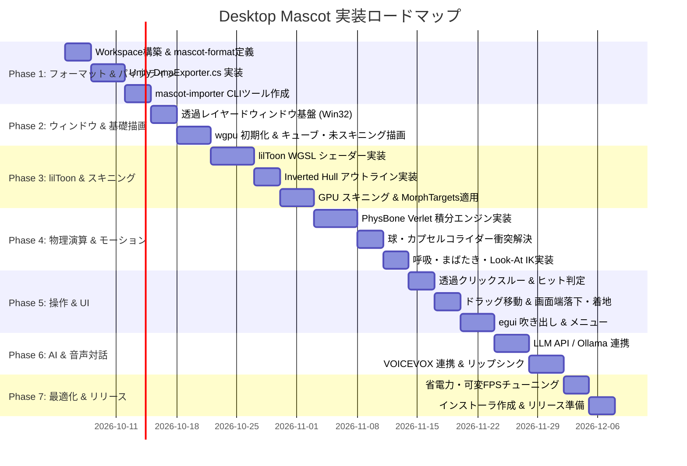

# 実装ロードマップ＆計画書 (Implementation Plan)

## 1. 開発フェーズ全体図

本プロジェクトは、基盤となるデータフォーマット定義から順を追い、段階的に動作確認（マイルストーン検証）を行いながら実装を進める。

---

## 2. 各フェーズの詳細作業項目と検証基準 (Acceptance Criteria)

### Phase 1: データフォーマット & エクスポートパイプライン
- **タスク**:
  1. Rust Cargo Workspace の初期化（`mascot-format`, `mascot-renderer`, `mascot-physics`, `mascot-app`, `mascot-importer`）。
  2. `mascot-format` に `.dma` バイナリ構造体（ヘッダー、メッシュ、ボーン、マテリアル、PhysBone）を定義。
  3. Unity用エディタ拡張 `DmaExporter.cs` を実装し、Unity batchmode でのアバター出力に対応。
  4. `mascot-importer` CLI を実装し、`.dma` のパースと整合性バリデーション（頂点数、ボーン参照整合性チェック）を実施。
- **検証基準**:
  - サンプルVRChatアバター（桔梗など）から `.dma` ファイルがエラーなく生成され、CLI検証で全チャンクが正常パースできること。

---

### Phase 2: 透過ウィンドウ & 基礎レンダリング
- **タスク**:
  1. `winit` と `windows-rs` による境界線なし・最前面・完全透過ウィンドウの作成 (`WS_EX_LAYERED`, `DwmExtendFrameIntoClientArea`)。
  2. `wgpu` インスタンス、アダプタ、サーフェスの初期化 (`CompositeAlphaMode::PreMultiplied`)。
  3. 透過ウィンドウ上にアルファ値を持つテストメッシュ（回転する半透明キューブ）を描画。
- **検証基準**:
  - デスクトップ壁紙や背面のブラウザの上に、黒ずみや境界のフリンジなしに半透明オブジェクトが合成表示されること。

---

### Phase 3: lilToon WGSL シェーダー & スキニング
- **タスク**:
  1. lilToonの2段階陰影モデル（`shade_border`, `shade_blur`）およびリムライト・発光をWGSLで再現。
  2. Inverted Hull（裏面押し出し）によるアウトライン描画パスの追加（距離・FOVスケール補正付き）。
  3. 頂点スキニング（行列パレット）およびBlendShape（表情モーフィング）のCompute/Vertex実装。
- **検証基準**:
  - Unityエディタ上での表示と目視で同等レベルのアニメ調シェーディングとアウトラインがマスコット上で描画されること。

---

### Phase 4: PhysBone 物理演算 & プロシージャルモーション
- **タスク**:
  1. 位置ベースのVerlet積分によるスプリング・ダンピング・重力シミュレーションの実装。
  2. SphereおよびCapsuleコライダーとの接触・めり込み防止処理の実装。
  3. 呼吸（Chestサイン波）、確率論的まばたき、マウスカーソル追従（Look-At IK）の実装。
- **検証基準**:
  - アバターの髪やリボンが自然に揺れ、頭部や肩にめり込まず、マウスの動きに合わせて視線がスムーズに追従すること。

---

### Phase 5: デスクトップインタラクション & egui UI
- **タスク**:
  1. `WM_NCHITTEST` による透明ピクセルのクリックスルー（背面アプリへの入力通過）とマスコット本体ヒット判定の実装。
  2. キャラクターのドラッグ移動、空中ドロップ時の自由落下、タスクバー上端への着地バウンド処理。
  3. `egui-wgpu` を用いた頭上フローティング吹き出しおよび右クリックメニューの実装。
- **検証基準**:
  - 透明領域をクリックしたときは背面のChromeやメモ帳が操作でき、マスコットをクリックしたときは掴んで移動・頭撫でができること。

---

### Phase 6: AI 対話 & 音声合成リップシンク
- **タスク**:
  1. Ollama（ローカル）および OpenAI/Gemini API によるストリーミング対話クライアントの実装。
  2. アクティブウィンドウ検知（Win32 `GetForegroundWindow`）に基づく作業見守りコンテキストプロンプトの注入。
  3. VOICEVOX HTTP API 連携による音声再生と、音量振幅解析による母音BlendShapeリップシンクの実装。
- **検証基準**:
  - チャット入力または定期トリガーで、キャラクターの口調で吹き出しに文字がタイピング表示され、同時に合成音声が再生され口が動くこと。

---

### Phase 7: 最適化 & リリースパッケージ
- **タスク**:
  1. マウス操作・モーション静止時の可変FPS制御（60fps $\to$ 30fps $\to$ 15fps $\to$ ダーティ更新抑制）。
  2. メモリプロファイリング（200MB以下を目標）とリーク検証。
  3. Windowsインストーラ（WiXまたはNSIS）／ワンバイナリ配布アーカイブの作成。
- **検証基準**:
  - アイドル時のCPU使用率 < 2%、GPU使用率 < 3%、メモリ消費 < 200MB を達成していること。

---

## 3. リスク要因と対策 (Risk Management)

| リスク | 影響度 | 発生確率 | 予防・回避策 |
| :--- | :---: | :---: | :--- |
| **GPU / OSコンポジタの互換性問題** (DWMでのアルファ抜けや黒背景化) | 高 | 中 | `CompositeAlphaMode::PreMultiplied` を厳格に適用し、DirectX 12 と Vulkan の両バックエンドでのフォールバック機構を用意。 |
| **複雑なPhysBone設定による挙動破綻** (ボーンの爆発・過剰な伸び) | 中 | 中 | 位置補正ステップでボーン長の制約（Distance Constraint）を厳密に反復実行（3〜5回）し、物理デルタタイムの上限（Max $\Delta t = 0.033\text{s}$）を設ける。 |
| **Unity batchmode 実行環境の差異** | 中 | 低 | Unity.exeのパスをレジストリおよびUnity Hub設定から自動検出するロジックを実装し、エディタ拡張の手動エクスポートUIも併設する。 |
| **常駐アプリとしての高負荷・電力消費** | 高 | 中 | ユーザーの無操作時間やフルスクリーンアプリ起動をWin32 APIで検出し、即座に低フレームレートモード（15fpsまたは描画停止）へ移行する。 |
